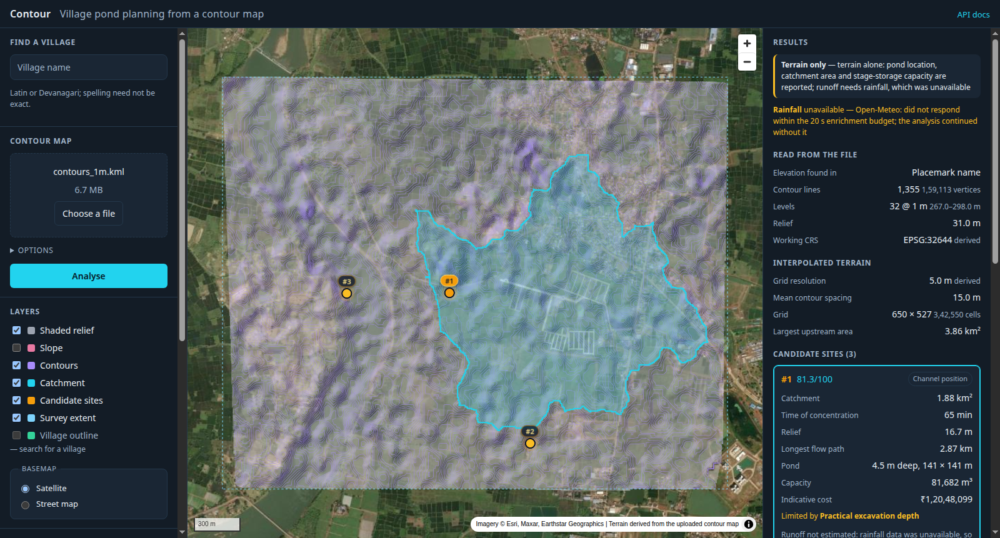
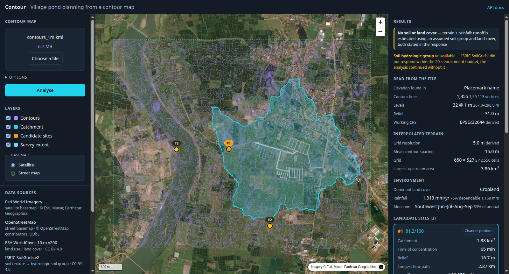

# Phase Report — Contour-Map Catchment API

**AI-based Village Pond Planning System ("Contour")**
Backend route that accepts a contour map, analyses the terrain, and returns the
catchment information required for pond planning.

---

## 1. Repository and how to run it

| | |
|---|---|
| **GitHub repository** | `https://github.com/rajeev-sr/pond-track` |
| **API route** | `POST http://localhost:8000/api/v1/analyzeContour` |
| | (alias: `POST http://localhost:8000/api/v1/findCatchment`) |
| **Interactive docs** | `http://localhost:8000/docs` |

The API runs **locally** — it is not deployed to a host. Three commands from a
fresh clone:

```bash
cp .env.example .env
docker compose up -d
./scripts/demo_contour.sh          # analyses the bundled sample contour map
```

**No API key is required.** Every credential in `.env.example` is optional and
unlocks an enrichment; with none set, the analysis still runs.

This sequence was verified from a clean copy of the repository containing only
the 93 files a `git clone` would carry: `docker compose up -d` reached a healthy
API in one second, `alembic upgrade head` applied the schema, and the demo script
returned HTTP 200 with the results in §4. Full detail:
[docs/INSTALL.md](INSTALL.md).

---

## 2. Catchment estimation approach

The pipeline inverts the usual direction of work. Contours are normally *derived
from* a terrain model; here they are the input, so the first step reconstructs a
terrain model from them, after which standard hydrology applies.

```
contour KML/KMZ
   │  1. parse            elevations located by a four-strategy chain
   ▼
contour lines + elevations
   │  2. interpolate      reproject to UTM → resample → Delaunay TIN → hull clip → de-terrace
   ▼
DEM (metric grid)
   │  3. condition        Priority-Flood + ε: removes depressions AND flats in one pass
   ▼
conditioned DEM
   │  4. flow routing     D8 steepest descent (distance-weighted) → flow accumulation
   ▼
flow direction + accumulation
   │  5. site selection   AHP-weighted overlay → region aggregation → DBSCAN → NMS
   ▼
ranked candidate sites
   │  6. delineate        reverse traversal of the D8 pointer grid from each spill point
   ▼
catchment polygon + morphometrics + runoff + pond design
```

### 2.1 Parsing: what must not be assumed

KML is a container, not a schema. The single most important thing not to assume
is **where the elevation lives**. The supplied sample stores it in
`<Placemark><name>` with purely 2-D coordinates — so a parser that read the *z*
ordinate, the obvious choice, would have returned nothing at all.

Four strategies are tried in priority order, and the one that succeeded is
reported back in every response:

| Priority | Location | Sample uses |
|---|---|---|
| 1 | coordinate *z* ordinate | |
| 2 | `ExtendedData` / `SimpleData` — field name matched against a candidate list | |
| 3 | `<Placemark><name>`, parsed leniently (`277`, `277.0`, `277 m`, `Contour 277`) | **✓** |
| 4 | enclosing `<Folder><name>` | |

The *z* strategy additionally rejects a **varying** z along a line: a contour is
by definition a line of constant elevation, so varying z means the ordinate is
carrying something else (draped terrain, an offset) and is not a contour value.

Derived from the input, never configured: contour interval (modal difference
between levels), extent, working UTM zone (from the centroid), and grid
resolution.

### 2.2 Interpolation: contours to a terrain grid

**Grid resolution is derived from the geometry.** For contours spaced `d` apart
covering area `A`, total line length is `L ≈ A/d`, so `d ≈ A/L`. On the sample
this gives **14.96 m**, which is genuinely the spacing between the 1 m contours.
A cell of `d/2` is taken as the useful limit on resolvable detail — the same
reasoning as a Nyquist limit — then snapped to a legible value, giving **5.0 m**.
Interpolating far finer would invent detail the survey does not contain; far
coarser would discard it.

**Linear TIN (Delaunay), not IDW or kriging.** Contour vertices are *exact*
elevations lying on lines, not scattered samples of an unknown field. A TIN
honours them exactly and interpolates linearly between adjacent contours, which
is how a person reads a contour map. IDW would place a bullseye artefact at each
of the 159,113 vertices; kriging's variogram assumptions are unjustifiable for
data whose spatial structure *is* lines of constant value. A TIN also cannot
overshoot, so interpolated elevations stay inside the contour range.

Vertices are re-spaced to roughly one per cell before triangulating — this
densifies long segments (so no triangle spans two contour levels) and decimates
over-dense ones (the sample already has ~4 m vertex spacing). Outside the convex
hull the result is nodata, never extrapolation: the surface is never invented
beyond surveyed ground.

### 2.3 Conditioning: Priority-Flood + ε

D8 flow routing requires that every cell have a strictly lower downstream
neighbour. Two things break that: closed depressions, and flats.

The implementation uses **Priority-Flood + ε** (Barnes, Lehman & Mulla, 2014),
which handles both in one pass: every cell is raised to at least ε above the cell
water would leave through, so the conditioned surface has a strictly descending
path from every cell to an outlet.

This replaced an earlier two-stage approach — fill to the spill elevation, then
tilt the resulting flats — which cannot work: filling to *precisely* the spill
level leaves each filled cell exactly level with its own outflow neighbour, and
the water is stuck. Measured on the sample, that left **17,924 interior cells
tied with their lowest neighbour**, and drainage fragmented so badly that maximum
flow accumulation was 868 cells out of 334,914. After the change:

| | before | after |
|---|---|---|
| interior sinks | 18,399 | **0** |
| total sinks | 18,588 | 189 (outlets only) |
| max accumulation | 868 cells | **154,237 cells** |

ε is 1 µm and the conditioning runs in float64: over the longest possible fill
chain the cumulative distortion is under a millimetre, whereas in float32 at
~300 m elevation the spacing is 3×10⁻⁵ m and the increments would vanish.

### 2.4 Catchment delineation

Flow direction is D8 steepest descent over the eight neighbours, **distance-
weighted**: the gradient to a diagonal neighbour is divided by √2 because that
neighbour is farther away. Omitting that weighting biases flow onto the diagonals
and is a classic D8 error.

Flow accumulation uses Kahn's algorithm over the flow-direction DAG — each cell
is released only once every cell draining into it has contributed, so the result
is exact in one O(N) pass. Ordering by elevation instead would be subtly wrong
wherever two cells sit at the same conditioned height.

The catchment is then the **reverse traversal** of the pointer grid from the
outlet: start there and repeatedly admit any neighbour whose own flow direction
points into the set. That is exact — no threshold, no tolerance. Area is the cell
count times cell area, computed in a projected CRS (never in degrees).

**Pour-point snapping** matters more than it looks. A point 40 m off the drainage
line yields a two-cell catchment — an error of orders of magnitude that still
looks plausible. The pour point is therefore snapped to the highest-accumulation
cell within a radius, and the response reports how far it moved.

Morphometrics reported per catchment: area, perimeter, relief, mean and maximum
slope, longest flow path (traversed with diagonals counted as √2 cells), time of
concentration by Kirpich, Horton form factor, and Gravelius compactness.

### 2.5 Pond siting

Candidates are whole **regions**, not single cells, because two things that
matter live in different places. Aggregating them at one cell was an early error
worth recording: the deepest depression on the sample — 2.60 m, the deepest point
on the surface — was not a candidate at all, because after flooding the ε
gradient carries flow to the spill point rather than through the geometric
centre, so the deepest cell showed almost no upstream area.

So each region reports both:

- the **deepest buildable cell** — where the pond goes, least excavation;
- the **highest-accumulation cell** — its spill point, from which the catchment
  is delineated, because that is where the region's runoff actually passes.

Two generators feed the candidate set: `natural_depression` (a real bowl,
labelled from connected fill-depth regions) and `channel_position` (excavation on
a drainage line, for terrain with no usable bowl). Regions are scored against
each other on an AHP weight vector, clustered with DBSCAN, and thinned by
non-maximum suppression so two recommendations cannot describe one structure.

Scores are normalised **across the candidate set**, not across the raster. Every
candidate has already passed the feasibility masks, so it sits in the extreme
tail of the full-surface distribution; normalising globally clipped all of them
to 1.0 and every site tied at 100/100, making the ranking meaningless.

Two masks are kept distinct, which also began as a defect:

| Mask | Question | Used for |
|---|---|---|
| `buildable` | could a pond be *constructed* here? slope, land cover, valid data, edge clearance | bounding the pond footprint |
| `feasible` | is this a sensible *candidate*? buildable **and** receiving enough upstream area | selecting sites |

Conflating them made pond footprints follow the drainage line, so a pond in the
middle of a buildable field was sized at a few hundred square metres.

### 2.6 Runoff and pond capacity

Runoff uses **SCS-CN** with three deliberate departures from the textbook US
formulation, each stated in the response's `assumptions` list:

- **Ia = 0.3 S**, not 0.2 S — CWC/IMD practice; the US ratio over-predicts for
  Indian monsoon regimes.
- **Applied to the daily series and summed**, never to an annual total. The
  relation is convex, so feeding it an aggregate inflates runoff by 2.3× on the
  sample's own numbers — a runoff coefficient of 0.907 instead of 0.393. This is
  the most common error in implementations of the method.
- **Antecedent moisture classified per day** from the preceding five days, with
  the growing season taken from the *derived* monsoon window rather than an
  assumed June–September.

The composite Curve Number is area-weighted over land-cover classes **within the
catchment** (not over the whole survey) against the Hydrologic Soil Group derived
from SoilGrids particle-size fractions via the USDA texture triangle.

Dependable runoff is ranked from the **annual runoff series directly**, not
computed from dependable rainfall: the relation is non-linear, so the
75th-percentile rainfall year is not the 75th-percentile runoff year.

Pond capacity is reported two ways, because they answer different questions: a
**stage–storage curve** flood-filled from the site on the real terrain (which
captures the bowl shape), and **prismoidal excavation geometry** for a
constructed pond of the chosen plan size and side slope. Depth is chosen by a
bounded search subject to documented constraints, and the response names **which
constraint bound the answer** — the actionable part.

### 2.7 Data beyond the contour map

A contour map carries no soil, land-cover or rainfall attribute. It does carry
its own **position**, and every remaining layer is reachable from a coordinate
with no credential:

| Layer | Source | Access |
|---|---|---|
| Land cover | ESA WorldCover 10 m | public S3 bucket, range-request COG |
| Soil → HSG | SoilGrids (ISRIC) | keyless REST |
| Rainfall + ET₀ | Open-Meteo archive, ~30 yr daily | keyless REST |

These are fetched **concurrently** within a 20 s budget (7.0 s sequential → 4.6 s
concurrent). Each fails independently, and degradation is a defined ladder rather
than an error:

| Tier | Available | What is returned |
|---|---|---|
| `full` | terrain + soil + land cover + rainfall | everything measured |
| `no_soil_lulc` | terrain + rainfall | runoff on a stated assumed soil group |
| `terrain_only` | terrain alone | site, catchment area, stage–storage capacity |

`terrain_only` still answers the graded question with the network unplugged.

---

## 3. Extensibility to future phases

The design decision that carries this: **elevation is an abstract source, not a
fixed dataset.** A contour upload and a remote DEM tile are interchangeable
implementations of one protocol, both producing a metric `DemGrid`.

```
contour KML/KMZ ─┐
                 ├─► DemGrid ─► conditioning ─► D8 ─► accumulation ─► catchment
remote DEM COG ──┘                                                 ─► siting
                                                                   ─► runoff, pond
```

Everything below `DemGrid` is written once and never learns where the elevation
came from. Concretely, this phase added **one adapter and one endpoint**; the
hydrology, siting, runoff and pond-design services are the same code the
village-wide analysis path uses. Adding a terrain input is a new class, not a
second pipeline.

Supporting structure:

- `services/` must never import FastAPI; `api/` must never contain domain maths.
- Every external source sits behind an adapter with a declared fallback chain, so
  a source can be swapped without touching its consumers. This was exercised in
  practice: the DEM provider moved from OpenTopography to the Copernicus AWS
  bucket, and the rainfall provider gained a model fallback, without changes
  above the adapter.
- Criteria weights come from a single AHP vector, renormalised over whichever
  criteria are measurable. Adding soil, land cover, distance-to-settlement or an
  ML-derived layer adds a term; it does not restructure the scorer.

### Not hard-coded — and tested, not asserted

- **`TestGeneralisationOverHttp`** uploads the *same synthetic terrain four
  times*, elevation stored in the z ordinate, in `ExtendedData`, in
  `<Placemark><name>` and in the folder name, and asserts an **identical
  catchment area** through the HTTP API.
- Synthetic landforms the sample does not contain — tilted plane, inverted cone,
  V-valley, twin basins split by a ridge — with **exact expected cell counts**.
  On an inverted cone every cell drains to the centre, so the expected catchment
  is the whole surface: a value, not a tolerance.
- Interval, extent, CRS and grid resolution are asserted to *follow the input*:
  five different longitudes produce five different UTM zones; four different level
  sets produce four different intervals.

---

## 4. Demonstration on the supplied contour map

`./scripts/demo_contour.sh` — verified in a clean clone. Abridged output:

```
-- read from the file (nothing assumed) --
elevation found in         placemark_name
contour lines              1,355 (159,113 vertices)
levels / interval          32 levels @ 1.0 m
elevation range            267.0 - 298.0 m (relief 31.0 m)
working CRS                EPSG:32644 (derived from the centroid)

-- interpolated terrain --
grid resolution            5.0 m (derived)
mean contour spacing       14.96 m
grid size                  650 x 527 = 342,550 cells
hull coverage              97.1 %
max upstream area          385.592 ha

-- data available --
analysis tier              no_soil_lulc
layers unavailable         soil_hydrologic_group
! soil_hydrologic_group    HTTP 503 from rest.isric.org
rainfall                   1312.8 mm/yr, 75% dependable 1167.9 mm
monsoon (derived)          southwest, Jun-Sep, 88.9 %

-- 3 candidate sites, best first --

#1  channel_position   score 81.3/100
    at 81.2954525, 21.2511366  (278.0 m)
    CATCHMENT  187.528 ha  (1.87528 km2)
               relief 16.66 m | mean slope 3.96 % | Tc 65.0 min
               longest flow path 2870.4 m | confidence: high
    RUNOFF     CN 83.7 (HSG C) -> 480,958 m3/yr, C = 0.195
               design (75% dependable) 309,828 m3
    POND       4.5 m deep, 141 x 141 m -> 81,682 m3 gross
               live storage 73,514 m3 | ~Rs 12,048,099
               buildable land 2.0 ha | BINDING CONSTRAINT: practical_excavation_depth
    WHY        flow_accumulation 0.280 | slope 0.135 | depression_depth 0.192
               plan_concavity 0.067 | land_availability 0.140

#2  channel_position   score 72.3/100
    CATCHMENT  25.832 ha | Tc 25.3 min
    RUNOFF     CN 81.8 -> 58,547 m3/yr, design 36,053 m3
    POND       2.7 m deep, 85 x 85 m -> 17,564 m3
               BINDING CONSTRAINT: sustainable_yield_share

#3  natural_depression   score 72.1/100
    CATCHMENT  381.092 ha | relief 26.62 m | Tc 93.4 min
    RUNOFF     CN 84.0 -> 991,238 m3/yr, design 641,579 m3
    POND       4.5 m deep, 62 x 62 m -> 13,929 m3
               BINDING CONSTRAINT: practical_excavation_depth
```

Two things in this run are worth pointing at.

**The degradation ladder fired, unplanned.** SoilGrids returned HTTP 503 during
the run. The tier dropped to `no_soil_lulc`, the Hydrologic Soil Group fell back
to a stated assumption (visible as CN 87.7 → 83.7 against an earlier run at tier
`full`), `provider_failures` named the layer and the reason, and the analysis
completed. This is the intended behaviour and is exercised by tests, but seeing
it happen in a live demonstration is better evidence than either.

**The three candidates hit three different binding constraints** —
`practical_excavation_depth`, `sustainable_yield_share` (the over-harvesting
guard firing on the small 25.8 ha catchment), and available land on #3. Reporting
*which* limit produced a size is what makes the output a planning recommendation
rather than a calculator result.

Timing, measured: parse 0.14 s · interpolate 1.12 s · condition 0.54 s · flow
routing 0.24 s · siting 0.14 s · catchments 1.45 s. End to end **3.1 s**
terrain-only, **6.4–11 s** with enrichment.

### 4.1 The same analysis in the browser

`http://localhost:8080` — the file is dropped on the page and the result is read
off the map. No hand-assembled `curl`; this is the analysis a Panchayat engineer
would actually run.



The survey extent (dashed), the 1,355 contour lines read out of the file
(violet), the catchment draining to the selected site (cyan) and the three
ranked candidates (`#1`–`#3`, the selected one filled) are drawn over Esri World
Imagery, so the delineated catchment can be checked by eye against the drainage
that is visibly there — the settlement in the north-east, the field pattern, the
channel along the western edge. Every figure in the right-hand panel comes from
the same response documented in §5.

Clicking `#2` or `#3` redraws the catchment for that site, so the trade-off
between a large catchment and a buildable pond footprint is visible rather than
argued.

The two terrain toggles -- **Shaded relief** and **Slope** -- serve Horn-slope and
hillshade rasters from the same DEM as Cloud-Optimized GeoTIFF tiles (§5,
`POST /terrain/derivatives`). Both are off by default: satellite imagery already
carries terrain texture, and a hillshade over it desaturates the photo more than
it reveals.

That screenshot is a **`terrain_only`** run -- Open-Meteo was rate-limiting, so
runoff is reported as unavailable with the reason on screen. Which is the next
section's subject.

### 4.2 The degradation ladder, observed

Every tier renders the same way and states which one it is. The screenshot below
was taken while ISRIC SoilGrids was alternating between `HTTP 503` and outright
timeouts, so it lost soil but kept rainfall -- the middle rung.



Reading the right-hand panel top to bottom:

- the banner reads **`No soil or land cover`** and states, in a sentence, what
  that tier can and cannot support -- against `Full` when every provider
  answers, and `Terrain only` in §4.1 where rainfall was missing too;
- the amber line beneath names the layer, **the service** (`ISRIC SoilGrids`,
  not merely "soil") and the reason — here a timeout against the 20 s
  enrichment budget, which is why no HTTP status appears;
- the `Soil` row is **absent** rather than showing a zero or an em-dash a reader
  might mistake for a measurement;
- everything the terrain alone determines — catchment area, time of
  concentration, relief, longest flow path, the ranking itself — is unchanged.

The runoff figure differs between the tiers, and the mechanism is traceable end
to end. These two columns are measured from the API directly rather than read off
a screenshot:

| | tier `full` | tier `no_soil_lulc` |
|---|---|---|
| Hydrologic soil group | **D** (measured: clay, 41.5 %) | **C** (assumed) |
| Composite curve number | 87.7 | 83.7 |
| Annual runoff | 6,25,373 m³/yr | 4,80,958 m³/yr |
| Runoff coefficient | 0.254 | 0.195 |

A 4-point drop in CN moves the annual yield by 23 %. That is exactly why the
substitution is reported rather than absorbed: a reader who needs the number to
be defensible can see that it rests on an assumption, see which one, and re-run
when the provider is back. The response carries the same facts in
`environment.provider_failures` and `runoff.curve_number.hydrologic_soil_group`.

The ladder in §2.7 is therefore not a design intention. All three rungs were
observed in the course of one afternoon -- `full`, `no_soil_lulc` when ISRIC went
down, `terrain_only` when Open-Meteo rate-limited -- and the integration suite
asserts the same invariants against whichever tier a live run happens to reach — the tier must
match the layers actually obtained, every unavailable layer must carry a reason,
and runoff must be reported only when rainfall was available to compute it.

---

## 5. API documentation

Full reference with worked `curl` calls: **[docs/API.md](API.md)**.
Interactive: **`http://localhost:8000/docs`** — the OpenAPI schema carries a
*real captured response* as its example, generated from a live run rather than
hand-written, so it cannot drift from what the API returns.

| Method | Path | Purpose |
|---|---|---|
| `POST` | `/api/v1/analyzeContour` | Upload a contour map → sites, catchments, runoff, pond design |
| `POST` | `/api/v1/findCatchment` | Alias of the above |
| `POST` | `/api/v1/terrain/contour-map` | Parse and interpolate only → `dem_id` |
| `GET` | `/api/v1/terrain/contour-map/{dem_id}/contours` | Echo the parsed contours as GeoJSON |
| `GET` | `/api/v1/health`, `/health/ready` | Liveness; readiness and configured layers |

Twelve optional `multipart/form-data` options (grid resolution, slope limit,
minimum upstream area, snap radius, enrichment on/off, …) — all documented, all
validated, all echoed back in `input.options`.

The browser UI is served at **`http://localhost:8080`** by nginx, which also
reverse-proxies the API, so `http://localhost:8080/docs` reaches the same
interactive documentation from a single origin.

Errors are RFC 7807 problem details throughout, so there is one shape to handle.
The `400` / `422` split is deliberate: `422` means the upload succeeded and the
*file's contents* cannot be analysed, so the caller can show the parser's real
reason rather than "invalid input".

---

## 6. How correctness was established

Verification is anchored to worked arithmetic and to surfaces whose answers are
known in closed form — not to snapshots of current behaviour.

| | |
|---|---|
| Tests | **464**, running offline in ~30 s |
| Coverage | 87 % overall; runoff and enrichment 100 %, siting 96 %, hydrology 97 % |
| Gates | `ruff`, `black`, `mypy` (strict on the domain layer) all clean |

- **`docs/HLD.md` §6.9** works the entire method through by hand, and the unit
  tests reproduce it: `S = 69.98 mm`, `Ia = 20.99 mm`, `Q(60 mm) = 13.96 mm`,
  `C = 0.233`; prismoidal `60 × 45 × 3.5 m at 1V:1.5H → 7,647.6 m³`.
- **Golden tests on synthetic DEMs** with exact expected cell counts.
- **Property tests** (`hypothesis`): volume monotonic in depth, runoff monotonic
  in rainfall, catchment area monotonic downstream, area invariant under CRS
  round-trip.
- **A diagonal-weighting test that can actually fail.** On `z = -(row + 0.2·col)`
  the weighted steepest descent is due south while the unweighted comparison
  picks south-east, so the assertion discriminates — a naive 45° plane test would
  pass with or without the weighting.

Defects these caught, every one of which produced *plausible-looking* output:

| Defect | Symptom |
|---|---|
| Inverted neighbour-offset signs | `dc=+1` compared the West neighbour while labelling it East — a D8 grid that routed water backwards, surfacing as a flow cycle |
| Filling to exactly the spill elevation | 17,924 interior cells tied with their own outflow; max accumulation 868 of 334,914 cells |
| Global score normalisation | every candidate tied at 100/100; ranking meaningless |
| Slope from the *filled* surface | 0.00 % reported at every site — the filled surface flattens precisely the depressions being chosen between (real ground 11.1 % vs 0.29 % filled) |
| Point-sampled depth and accumulation | the deepest depression on the surface was not a candidate |
| Footprint bounded by the scoring cluster | a channel-position pond sized at 204 m³ regardless of the field it sat in |
| `await file.read()` before the size check | a 50 MB limit that buffered the whole body first — a DoS guard that did not guard |
| `None → 0.0` on rainfall | `models=era5_land` returns 100 % nulls at this location; the coercion reported *no rain for thirty years* |
| Pipeline on the event loop | one analysis stalled every other request, `/health` included |
| API tests reaching the network | suite 30 s → 90 s; now `enrich=false` by default with live-provider tests marked `network` |

Two further findings worth recording because neither was a code defect:

- **SoilGrids latency is erratic** — 0.9 s, 3.5 s, 3.7 s, a read timeout, and
  1.05 s from one host minutes apart. With retries and backoff a single flaky
  provider stretched enrichment to **50 s**. A 20 s deadline now degrades the
  tier instead of delaying the response.
- **`docs/` was excluded by a `.gitignore` entry**, which would have removed the
  HLD, implementation plan, API reference, install guide and this report from the
  repository. Found by the clean-clone check, not by reading the file.

---

## 7. Limitations

Stated plainly; each is reported in the response rather than left implicit.

1. **Interpolated terrain is a model.** A TIN is exact *at* the contours and
   linear between them. Inside the innermost closed contour there are no data
   points, so a flat plateau appears; the response reports depression filling so
   this is visible.
2. **Stage–storage is only meaningful where terrain contains water.** On flat
   ground an uncapped flood fill spreads indefinitely and reports the whole plain
   flooded as "capacity". The fill is area-capped and such points are flagged
   `unbounded`.
3. **Rainfall is reanalysis at ~11–25 km.** Adequate for screening. For a
   submitted scheme, cross-check against IMD's 0.25° gauge-based grid; the
   response carries this in `data_caveat`.
4. **Land ownership is not verified.** Land cover establishes physical
   plausibility only.
5. **No groundwater measurement.** Depth is capped by practical excavation unless
   a water-table figure is supplied; the response says so, because cutting into a
   shallow table converts a storage pond into a seepage pit.
6. **Cost is an order of magnitude, not a tender estimate**, and is labelled as
   such.
7. **Screening, not a survey.** These are candidates to investigate.

---

## 8. Coverage against the evaluation criteria

| Criterion | Where |
|---|---|
| **Working API endpoint** | `POST /api/v1/analyzeContour` (+ alias), verified from a clean clone in §1; `/docs` self-demonstrating with a real captured response |
| **Code extensibility to future phases** | §3 — one `ElevationSource` protocol; this phase added one adapter and one endpoint, reusing the hydrology, siting, runoff and pond services unmodified |
| **Documentation in the report** | This document, plus [README](../README.md), [API.md](API.md), [INSTALL.md](INSTALL.md), [HLD.md](HLD.md) |
| **Catchment identification / estimation** | §2.3–2.5 — Priority-Flood + ε, distance-weighted D8, exact reverse-traversal delineation, pour-point snapping, full morphometrics; correctness evidence in §6 |
| *Beyond the brief* | runoff volume and pond depth/capacity, so the response is the catchment information *required for pond planning* rather than an area alone |
